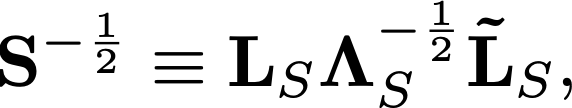
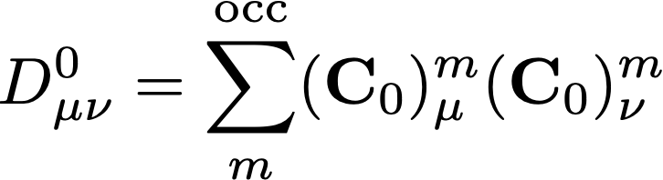

# Project #3: The Hartree-Fock self-consistent field (SCF) procedure

The purpose of this project is to provide a deeper understanding of Hartree-Fock theory by 
demonstrating a simple implementation of the self-consistent-field method. 
The theoretical background can be found in Ch. 3 of the text by Szabo and Ostlund or in the 
[nice set of on-line notes](http://vergil.chemistry.gatech.edu/notes/hf-intro/hf-intro.html) written by David Sherrill.
A concise set of instructions for this project may be found [here](./project3-instructions.pdf).

We thank Dr. Yukio Yamaguchi of the University of Georgia for the original version of this project.

The test case used in the following discussion is for a water molecule with a bond-length of 1.1 <html>&Aring;</html> 
and a bond angle of 104.0o with an STO-3G basis set.  The input to the project consists of the 
[nuclear repulsion energy](./input/h2o/STO-3G/enuc.dat)
   and pre-computed sets of one- and two-electron integrals: 
[overlap integrals](./input/h2o/STO-3G/s.dat),
[kinetic-energy integrals](./input/h2o/STO-3G/t.dat),
[nuclear-attraction integrals](./input/h2o/STO-3G/v.dat),
[electron-electron repulsion integrals](./input/h2o/STO-3G/eri.dat).

## Step 1: Nuclear Repulsion Energy

Read the nuclear repulsion energy from the [enuc.dat](./input/h2o/STO-3G/enuc.dat)

## Step 2: One-Electron Integrals

Read the AO-basis [overlap](./input/h2o/STO-3G/s.dat)

<picture>
  <source media="(prefers-color-scheme: dark)" srcset="./figures/dark/overlap.png">
  <source media="(prefers-color-scheme: light)" srcset="./figures/overlap.png">
  
</picture>

[kinetic-energy](./input/h2o/STO-3G/t.dat)

<picture>
  <source media="(prefers-color-scheme: dark)" srcset="./figures/dark/kinetic-energy.png">
  <source media="(prefers-color-scheme: light)" srcset="./figures/kinetic-energy.png">
  
</picture>

[nuclear-attraction integrals](./input/h2o/STO-3G/v.dat)

<picture>
  <source media="(prefers-color-scheme: dark)" srcset="./figures/dark/nuclear-attraction.png">
  <source media="(prefers-color-scheme: light)" srcset="./figures/nuclear-attraction.png">
  
</picture>

and store them in appropriately constructed matrices.  Then form the "core Hamiltonian":

<picture>
  <source media="(prefers-color-scheme: dark)" srcset="./figures/dark/core-hamiltonian.png">
  <source media="(prefers-color-scheme: light)" srcset="./figures/core-hamiltonian.png">
  
  
</picture>

Note that the one-electron integrals provided include only the *permutationally unique* integrals, but you should store the full matrices for convenience.  
Note also that the AO indices on the integrals in the files start with "1" rather than "0".

 * [Hint 1](./hints/hint2-1.md): Core Hamiltonian

## Step #3: Two-Electron Integrals

Read the two-electron repulsion integrals from the 
[eri.dat](./input/h2o/STO-3G/eri.dat) 
file.
The integrals in this file are provided in Mulliken notation over real AO basis functions:

<picture>
  <source media="(prefers-color-scheme: dark)" srcset="./figures/dark/eri.png">
  <source media="(prefers-color-scheme: light)" srcset="./figures/eri.png">
  
</picture>

Hence, the integrals obey the eight-fold permutational symmetry relationships:

<picture>
  <source media="(prefers-color-scheme: dark)" srcset="./figures/dark/permutational-symmetry.png">
  <source media="(prefers-color-scheme: light)" srcset="./figures/permutational-symmetry.png">
  
</picture>

and only the permutationally unique integrals are provided in the file, with the restriction that, for each integral, the following relationships hold:

<picture>
  <source media="(prefers-color-scheme: dark)" srcset="./figures/dark/index-restrictions.png">
  <source media="(prefers-color-scheme: light)" srcset="./figures/index-restrictions.png">
  
</picture>

where

<picture>
  <source media="(prefers-color-scheme: dark)" srcset="./figures/dark/compound-index-restrictions.png">
  <source media="(prefers-color-scheme: light)" srcset="./figures/compound-index-restrictions.png">
  
</picture>

Note that the two-electron integrals may be stored efficiently in a one-dimensional array and the above relationship used to map between given 
&mu;, &nu;, &lambda;, and &sigma; indices and a "compound index" defined as:

<picture>
  <source media="(prefers-color-scheme: dark)" srcset="./figures/dark/compound-index-restrictions2.png">
  <source media="(prefers-color-scheme: light)" srcset="./figures/compound-index-restrictions2.png">
  
</picture>

  * [Hint 1](./hints/hint3-1.md): Compound indices
  * [Hint 2](./hints/hint3-2.md): Pre-Computed Lookup Arrays
  * [Hint 3](./hints/hint3-3.md): Reading the two-electron integrals

## Step 4: Build the Orthogonalization Matrix

Diagonalize the overlap matrix:

<picture>
  <source media="(prefers-color-scheme: dark)" srcset="./figures/dark/diag-mw-hessian.png">
  <source media="(prefers-color-scheme: light)" srcset="./figures/diag-mw-hessian.png">
  
</picture>

where LS is the matrix of eigenvectors (columns) and &Lambda;S is the diagonal matrix of corresponding eigenvalues.

Build the symmetric orthogonalization matrix using:

<picture>
  <source media="(prefers-color-scheme: dark)" srcset="./figures/dark/symm-orthog-matrix.png">
  <source media="(prefers-color-scheme: light)" srcset="./figures/symm-orthog-matrix.png">
  
</picture>

where the tilde denotes the matrix transpose.

  * [Hint 1](./hints/hint4-1.md): S-1/2 Matrix

## Step 5: Build the Initial Guess Density

Form an initial (guess) Fock matrix in the orthonormal AO basis using the core Hamiltonian as a guess:

<picture>
  <source media="(prefers-color-scheme: dark)" srcset="./figures/dark/initial-fock.png">
  <source media="(prefers-color-scheme: light)" srcset="./figures/initial-fock.png">
  
</picture>

Diagonalize the Fock matrix:

<picture>
  <source media="(prefers-color-scheme: dark)" srcset="./figures/dark/diag-fock.png">
  <source media="(prefers-color-scheme: light)" srcset="./figures/diag-fock.png">
  
</picture>

Note that the &epsilon;0 matrix contains the initial orbital energies.

Transform the eigenvectors into the original (non-orthogonal) AO basis:

<picture>
  <source media="(prefers-color-scheme: dark)" srcset="./figures/dark/transform-coeff.png">
  <source media="(prefers-color-scheme: light)" srcset="./figures/transform-coeff.png">
  
</picture>

Build the density matrix using the occupied MOs:

<picture>
  <source media="(prefers-color-scheme: dark)" srcset="./figures/dark/density-matrix.png">
  <source media="(prefers-color-scheme: light)" srcset="./figures/density-matrix.png">
  
</picture>

where *m* indexes the columns of the coefficient matrices, and the summation includes only the occupied spatial MOs.

  * [Hint 1](./hints/hint5-1.md): Transformed Fock matrix
  * [Hint 2](./hints/hint5-2.md): Initial MO Coefficients
  * [Hint 3](./hints/hint5-3.md): Initial Density Matrix

## Step 6: Compute the Inital SCF Energy

The SCF electronic energy may be computed using the density matrix as:

<picture>
  <source media="(prefers-color-scheme: dark)" srcset="./figures/dark/initial-scf-energy.png">
  <source media="(prefers-color-scheme: light)" srcset="./figures/initial-scf-energy.png">
  
</picture>

The total energy is the sum of the electronic energy and the nuclear repulsion energy:

<picture>
  <source media="(prefers-color-scheme: dark)" srcset="./figures/dark/initial-total-energy.png">
  <source media="(prefers-color-scheme: light)" srcset="./figures/initial-total-energy.png">
  
</picture>

where *0* denotes the initial SCF energy.

 * [Hint 1](./hints/hint6-1.md): Initial Electronic Energy

## Step #7: Compute the New Fock Matrix 

Start the SCF iterative procedure by building a new Fock matrix using the previous iteration's density as:

<picture>
  <source media="(prefers-color-scheme: dark)" srcset="./figures/dark/new-fock.png">
  <source media="(prefers-color-scheme: light)" srcset="./figures/new-fock.png">
  
</picture>

where the double-summation runs over all the AOs and *i-1* denotes the density for the last iteration.

  * [Hint 1](./hints/hint7-1.md): New Fock Matrix
  * [Hint 2](./hints/hint7-2.md): Fock-Build Code

## Step #8: Build the New Density Matrix 

Form the new density matrix following the same procedure as in Step #5 above:

Orthogonalize:

<picture>
  <source media="(prefers-color-scheme: dark)" srcset="./figures/dark/orthog-fock.png">
  <source media="(prefers-color-scheme: light)" srcset="./figures/orthog-fock.png">
  
</picture>

Diagonalize:

<picture>
  <source media="(prefers-color-scheme: dark)" srcset="./figures/dark/diag-new-fock.png">
  <source media="(prefers-color-scheme: light)" srcset="./figures/diag-new-fock.png">
  
</picture>

Back-transform:

<picture>
  <source media="(prefers-color-scheme: dark)" srcset="./figures/dark/back-transform-coeff.png">
  <source media="(prefers-color-scheme: light)" srcset="./figures/back-transform-coeff.png">
  
</picture>

Compute the density:

<picture>
  <source media="(prefers-color-scheme: dark)" srcset="./figures/dark/compute-density.png">
  <source media="(prefers-color-scheme: light)" srcset="./figures/compute-density.png">
  
</picture>

where *i* denotes the current iteration density.

## Step #9: Compute the New SCF Energy 

Compute the new SCF energy as before:

<picture>
  <source media="(prefers-color-scheme: dark)" srcset="./figures/dark/compute-new-scf-energy.png">
  <source media="(prefers-color-scheme: light)" srcset="./figures/compute-new-scf-energy.png">
  
</picture>

where *i* denotes the SCF energy for the *i*th iteration.

## Step #10: Test for Convergence 
Test both the energy and the density for convergence:

<picture>
  <source media="(prefers-color-scheme: dark)" srcset="./figures/dark/convergence-test.png">
  <source media="(prefers-color-scheme: light)" srcset="./figures/convergence-test.png">
  
</picture>

If the difference in consecutive SCF energy and the root-mean-squared difference in consecutive densities do not fall below the prescribed thresholds, return to Step #7 and continue from there.

  * [Hint 1](./hints/hint10-1.md): Energies for Each Iteration

## Additional Concepts
###  The MO-Basis Fock Matrix
At convergence, the canonical Hartree-Fock MOs are, by definition, eigenfunctions of the Fock operator, viz.

<picture>
  <source media="(prefers-color-scheme: dark)" srcset="./figures/dark/canonical-mos.png">
  <source media="(prefers-color-scheme: light)" srcset="./figures/canonical-mos.png">
  
</picture>

If we multiply on the left by an arbitrary MO and integrate, we obtain:

<picture>
  <source media="(prefers-color-scheme: dark)" srcset="./figures/dark/mo-fock-matrix-element.png">
  <source media="(prefers-color-scheme: light)" srcset="./figures/mo-fock-matrix-element.png">
  
</picture>

In other words, the Fock matrix should be diagonal in the MO basis, with the orbital energies as its diagonal elements.  We can demonstrate this explicitly using the AO-basis Fock matrix by first re-writing the above expression using the LCAO-MO coefficients:

<picture>
  <source media="(prefers-color-scheme: dark)" srcset="./figures/dark/mo-fock-matrix.png">
  <source media="(prefers-color-scheme: light)" srcset="./figures/mo-fock-matrix.png">
  
</picture>

Use the above equation to transform the Fock matrix from the AO basis to the MO basis and demonstrate that it is indeed diagonal (to within the convergence limits of the SCF iterative procedure).

### One-Electron Properties 
As discussed in detail in Ch. 3 of the text by Szabo and Ostlund, the calculation of one-electron properties requires density matrix and the relevant property integrals.  The electronic contribution to the electric-dipole moment may be computed using,

<picture>
  <source media="(prefers-color-scheme: dark)" srcset="./figures/dark/electric-dipole-moment.png">
  <source media="(prefers-color-scheme: light)" srcset="./figures/electric-dipole-moment.png">
  
</picture>

where the vector notation implies three sets of dipole-moment integrals -- one for each Cartesian component of the dipole operator.

Two points to note:
  - In order to compute the total dipole moment, you must include the nuclear contribution, which requires the atomic numbers and Cartesian coordinates of the nuclei, in addition to the above.
  - The factor 2 appearing above arises because the definition of the density used in this project differs from that used in Szabo & Ostlund.

The test cases provided below include the structural information dipole integrals needed to compute the dipole moment.

### Population Analysis/Atomic Charges
A Mulliken population analysis (also described in Szabo & Ostlund, Ch. 3) requires the overlap integrals and the electron density, in addition to information about the number of basis functions centered on each atom.  The charge on atom *A* may be computed as:

<picture>
  <source media="(prefers-color-scheme: dark)" srcset="./figures/dark/atomic-charge.png">
  <source media="(prefers-color-scheme: light)" srcset="./figures/atomic-charge.png">
  
</picture>

where the summation is limited to only those basis functions centered on atom *A*.

## Test Cases
 * STO-3G Water: [Geometry](./input/h2o/STO-3G/geom.dat) | [Enuc](./input/h2o/STO-3G/enuc.dat) | [S](./input/h2o/STO-3G/s.dat) | [T](./input/h2o/STO-3G/t.dat) | [V](./input/h2o/STO-3G/v.dat) | [ERI](./input/h2o/STO-3G/eri.dat) | [Mu_X](./input/h2o/STO-3G/mux.dat) | [Mu_Y](./input/h2o/STO-3G/muy.dat) | [Mu_Z](./input/h2o/STO-3G/muz.dat) | [output](./output/h2o/STO-3G/output.txt)
 *  DZ Water: [Geometry](./input/h2o/DZ/geom.dat) | [Enuc](./input/h2o/DZ/enuc.dat) | [S](./input/h2o/DZ/s.dat) | [T](./input/h2o/DZ/t.dat) | [V](./input/h2o/DZ/v.dat) | [ERI](./input/h2o/DZ/eri.dat) | [Mu_X](./input/h2o/DZ/mux.dat) | [Mu_Y](./input/h2o/DZ/muy.dat) | [Mu_Z](./input/h2o/DZ/muz.dat) | [output](./output/h2o/DZ/output.txt)
 *  DZP Water: [Geometry](./input/h2o/DZP/geom.dat) | [Enuc](./input/h2o/DZP/enuc.dat) | [S](./input/h2o/DZP/s.dat) | [T](./input/h2o/DZP/t.dat) | [V](./input/h2o/DZP/v.dat) | [ERI](./input/h2o/DZP/eri.dat) | [Mu_X](./input/h2o/DZP/mux.dat) | [Mu_Y](./input/h2o/DZP/muy.dat) | [Mu_Z](./input/h2o/DZP/muz.dat) | [output](./output/h2o/DZP/output.txt)
 *  STO-3G Methane: [Geometry](./input/ch4/STO-3G/geom.dat) | [Enuc](./input/ch4/STO-3G/enuc.dat) | [S](./input/ch4/STO-3G/s.dat) | [T](./input/ch4/STO-3G/t.dat) | [V](./input/ch4/STO-3G/v.dat) | [ERI](./input/ch4/STO-3G/eri.dat) | [Mu_X](./input/ch4/STO-3G/mux.dat) | [Mu_Y](./input/ch4/STO-3G/muy.dat) | [Mu_Z](./input/ch4/STO-3G/muz.dat) | [output](./output/ch4/STO-3G/output.txt)
