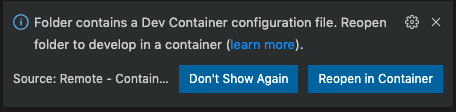

# Programming Tutorials in Computational Chemistry

This repo gathers several [projects](projects/README.md) that are aimed at providing interactive tutorials in quantum chemistry. If you are new to programming, we invite you to first work through the [bootcamps](bootcamps/README.md) in [C++](bootcamps/cpp/README.md), [Julia](bootcamps/julia/README.md) and/or [Python](bootcamps/python/README.md). If you are new to computing, we suggest working through the [Getting Started in Computational Chemistry](https://education.molssi.org/getting-started-computational-chemistry/) and [Best Practices](https://education.molssi.org/python-package-best-practices/) workshops offered by [MolSSI](https://molssi.org/).

> We note that you can always consult the table of contents to navigate the documents in this repo.

## Setup

We have preconfigured a development environment that contains everything you need to complete the projects. To use this development environment, you need to install two packages

- [Docker](https://www.docker.com/). Note that Windows users first need to install the [Windows Subsystem for Linux](https://docs.microsoft.com/en-us/windows/wsl/install).
- The [VSCode editor](https://code.visualstudio.com/), which is a [highly powerful and customizable cross-platform editor](https://code.visualstudio.com/docs/getstarted/introvideos). Inside the VSCode editor, install the `Remote - Containers` extension in VSCode. 

If you now open the folder in which this document is located in VSCode, you should get the option to open the folder in a custom Docker container.

This will initiate a **one-time** download and can take some time depending on your internet connection. If you have configured VSCode correctly in the steps above, you are now set up to start working on the projects.
