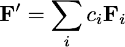
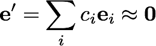
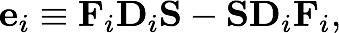
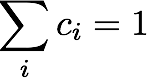
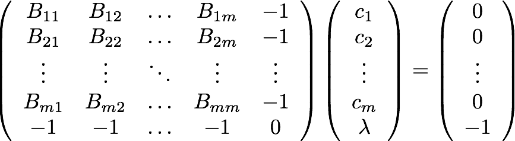
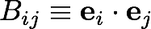

# Project #8: DIIS extrapolation for the SCF procedure

The convergence of the self-consistent field (SCF) algorithm presented in [Project #3](../Project%2303) is rather slow.
Even the STO-3G H<sub>2</sub>O example requires more than 20 iterations to converge the RMS density difference to a relatively loose threshold of 10<sup>-8</sup>.
One of the most effective methods for speeding up such iterative sequences is the 
"Direct Inversion in the Iterative Subspace (DIIS)" approach, which was 
[presented by Pulay](http://sirius.chem.vt.edu/wiki/lib/exe/fetch.php?media=crawdad:programming:sdoc8328.pdf)
in the 1980's.  The essential idea of the DIIS approach is as follows: 
if the current guess at the wave function/density matrix/Fock matrix is sufficiently close to the final (converged) result, 
a new guess may be constructed as a simple linear combination of the previous few iterates, 
where the coefficients of such an extrapolation are determined from Lagrangian minimization procedure.

The purpose of this programming project is to implement the Pulay DIIS procedure within the SCF algorithm from 
[Project #3](../Project%2303).

## Working Equations

Given a series of Fock matrices, <b><i>F<sub>i</sub></i></b> (expressed in the AO basis set), a new approximation to the converged solution may be written as



by requiring that the corresponding extrapolated "error" matrix



is approximately the zero matrix in a least-squares sense.  The error matrix for each iteration is given by



where <b><i>D<sub>i</sub></i></b> is the AO-basis density matrix used to construct 
<b><i>F<sub>i</sub></i></b>, and  <b><i>S</i></b> is the AO-basis overlap matrix.  Minimization of <b><i>e'</i></b> under the constraint that 



leads to the following system of linear equations for the c<sub>i</sub>:



where lambda is a Lagrangian multiplier and the elements <i>B<sub>ij</sub></i> are computed as dot products of error matrices:



## Step #1: Compute the Error Matrix in Each Iteration

Compute the error matrix for the current iteration using the matrix equation  for <b><i>e<sub>i</sub></i></b> given above.
Note that the density matrix you use must be the same one used to construct the corresponding Fock matrix.
If you print the error matrix in each iteration, you should be able to note that it gradually falls to zero as the SCF procedure converges.

## Step #2: Build the B Matrix and Solve the Linear Equations

After you have computed at least two error matrices, it is possible to begin the DIIS extrapolation procedure.
Compute the B matrix above for all of the current error matrices. 
(Note that the matrix is symmetric, so one need only compute the lower triangle to get the entire matrix).

Next, use a standard linear-equation solver (such as the DGESV function in the LAPACK library, 
to which PSI4 has an interface named C_DGESV) to compute the <b>c<sub>i</sub></b> coefficients. 
(NB: If you use the LAPACK solver, or any LAPACK or BLAS function for that matter, you must use matrices allocated as contiguous memory, 
as discussed in [Project #7](../Project%2307)).

## Step #3: Compute the New Fock Matrix

Build a new Fock matrix using the equation for <b><i>F'</i></b> above and continue with the SCF procedure as usual.
This implies that one must store all of the Fock matrices corresponding to each of the error matrices used in constructing the B matrix above.
Note:

  * Do **not** use the extrapolated Fock matrix to compute error matrices for subsequent DIIS steps.
  * Keep only a relatively small number of error matrices; six to eight are reasonable for closed-shell SCF calculations. When the chosen number of error
  matrices is exceeded delete the oldest error matrix.

Once the procedure is complete and working correctly, you should notice a considerable reduction in the number of SCF cycles required to achieve convergence.
For example, for the STO-3G/H<sub>2</sub>O test case from [Project #3](../Project%2303), 
the simple SCF algorithm converges to 10<sup>-12</sup> in the density in 39 iterations:
```
 Iter        E(elec)              E(tot)               Delta(E)             RMS(D)
 00    -125.842077437699    -117.839710375888
 01     -78.286583284740     -70.284216222929      47.555494152959       7.026491112304
 02     -84.048316253435     -76.045949191625      -5.761732968695       1.586429080972
 03     -82.716965960855     -74.714598899044       1.331350292581       0.329292871345
 04     -82.987140757002     -74.984773695191      -0.270174796147       0.120465253222
 05     -82.938133187513     -74.935766125703       0.049007569488       0.043060496803
 06     -82.946271078699     -74.943904016889      -0.008137891186       0.020309423061
 07     -82.944486784914     -74.942119723104       0.001784293785       0.009137578496
 08     -82.944617252243     -74.942250190433      -0.000130467329       0.004460301971
 09     -82.944503500703     -74.942136438892       0.000113751541       0.002127028935
 10     -82.944478930626     -74.942111868815       0.000024570077       0.001026790950
 11     -82.944461627685     -74.942094565874       0.000017302941       0.000494443064
 12     -82.944454198375     -74.942087136565       0.000007429310       0.000238548591
 13     -82.944450445051     -74.942083383241       0.000003753324       0.000115056300
 14     -82.944448661686     -74.942081599876       0.000001783365       0.000055511004
 15     -82.944447795931     -74.942080734120       0.000000865755       0.000026782106
 16     -82.944447379017     -74.942080317206       0.000000416914       0.000012922161
 17     -82.944447177685     -74.942080115875       0.000000201331       0.000006234890
 18     -82.944447080565     -74.942080018755       0.000000097120       0.000003008344
 19     -82.944447033699     -74.942079971889       0.000000046867       0.000001451536
 20     -82.944447011086     -74.942079949276       0.000000022613       0.000000700372
 21     -82.944447000175     -74.942079938365       0.000000010911       0.000000337933
 22     -82.944446994911     -74.942079933100       0.000000005265       0.000000163055
 23     -82.944446992371     -74.942079930560       0.000000002540       0.000000078675
 24     -82.944446991145     -74.942079929335       0.000000001226       0.000000037961
 25     -82.944446990554     -74.942079928743       0.000000000591       0.000000018316
 26     -82.944446990268     -74.942079928458       0.000000000285       0.000000008838
 27     -82.944446990131     -74.942079928320       0.000000000138       0.000000004264
 28     -82.944446990064     -74.942079928254       0.000000000066       0.000000002058
 29     -82.944446990032     -74.942079928222       0.000000000032       0.000000000993
 30     -82.944446990017     -74.942079928206       0.000000000016       0.000000000479
 31     -82.944446990009     -74.942079928199       0.000000000007       0.000000000231
 32     -82.944446990005     -74.942079928195       0.000000000004       0.000000000112
 33     -82.944446990004     -74.942079928193       0.000000000002       0.000000000054
 34     -82.944446990003     -74.942079928193       0.000000000001       0.000000000026
 35     -82.944446990002     -74.942079928192       0.000000000000       0.000000000013
 36     -82.944446990002     -74.942079928192       0.000000000000       0.000000000006
 37     -82.944446990002     -74.942079928192       0.000000000000       0.000000000003
 38     -82.944446990002     -74.942079928192       0.000000000000       0.000000000001
 39     -82.944446990002     -74.942079928192       0.000000000000       0.000000000001
```

With DIIS extrapolation using six error matrices, this is reduced to only ten iterations:

```
 Iter        E(elec)              E(tot)               Delta(E)             RMS(D)
 00    -125.842077437699    -117.839710375888
 01     -78.286583284740     -70.284216222929      47.555494152959       7.026491112304
 02     -82.579039780737     -74.576672718926      -4.292456495997       1.366619501600
 03     -83.108076865885     -75.105709804074      -0.529037085148       0.349635242477
 04     -82.957022995474     -74.954655933663       0.151053870411       0.082112373912
 05     -82.941311458592     -74.938944396782       0.015711536881       0.045048744784
 06     -82.944472996531     -74.942105934721      -0.003161537939       0.001798803069
 07     -82.944447027029     -74.942079965219       0.000025969502       0.000003764196
 08     -82.944446990675     -74.942079928865       0.000000036354       0.000000202704
 09     -82.944446990002     -74.942079928192       0.000000000673       0.000000001127
 10     -82.944446990002     -74.942079928192       0.000000000000       0.000000000000
```

## References

  * P. Pulay, "Convergence Acceleration of Iterative Sequences.  The Case of the SCF Iteration", *Chem. Phys. Lett.* **73**, 393-398 (1980).
  * P. Pulay, "Improved SCF Convergence Acceleration", *J. Comp. Chem.* **3**, 556-560 (1982).
  * T. P. Hamilton and P. Pulay, "Direct Inversion in the Iterative Subspace (DIIS) Optimization of Open-Shell, Excited-State, 
  and Small Multiconfiguration SCF Wave functions", *J. Chem. Phys.* **84**, 5728-5734 (1986).
