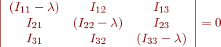

Here are two approaches for the [diagonalization](http://en.wikipedia.org/wiki/Diagonalizable_matrix) of the moment of inertia tensor:

## Secular Determinant
Since the moment of inertia tensor is only a 3x3 matrix, a brute-force approach via the secular determinant is feasible:



This leads to a cubic equation in &lambda;, which one can solve directly.  Have fun with that.

## More General Algorithms
"Canned" algorithms are definitely the way to go for general matrix diagonalization.  Most such algorithms are based on a two-step procedure:
  - Reduction of the matrix to a tridiagonal form using the [Householder](http://en.wikipedia.org/wiki/Householder's_method) or Givens approaches.
  - Diagonalization of the tridiagonal structure, either by solving its secular determinant or by other methods, e.g. [QR or QL decompositions](http://en.wikipedia.org/wiki/QR_decomposition).

A convenient canned library for a wide range of linear algebraic operations is the [Eigen package](http://eigen.tuxfamily.org).  This is a template-only library that provides a very clean interface for manipulating a large number of matrix types.  You can either download and install the library from  the [official website](http://eigen.tuxfamily.org) or just grab the [gzipped tarfile from here](../eigen.tar.gz).  Unpack the library in the same directory as your source code, and you're ready to get started.

To use the library to diagonalize your moment inertia tensor, follow these steps:

- Add the following lines to your main source file below the inclusion of other headers:
```c++
#include "Eigen/Dense"
#include "Eigen/Eigenvalues"
#include "Eigen/Core"

typedef Eigen::Matrix<double, Eigen::Dynamic, Eigen::Dynamic, Eigen::RowMajor> Matrix;
```
This code defines a new type called a `Matrix` that may be dynamically allocated and contains only doubles.
- Allocate your moment of inertia tensor by a line of code like:
```c++
Matrix I(3,3);
```
- Access or assign individual elements of the Matrix using parenthetical notation rather than brackets, e.g.:
```c++
I(0,0) = 2.0;
```
- The Eigen package makes it easy to examine your matrix using cout:
```c++
cout << I << endl;
```
- After you have built the moment of inertia tensor, you may compute its eigenvalues and eigenvectors as follows:
```c++
  Eigen::SelfAdjointEigenSolver<Matrix> solver(I);
  Matrix evecs = solver.eigenvectors();
  Matrix evals = solver.eigenvalues();
```
